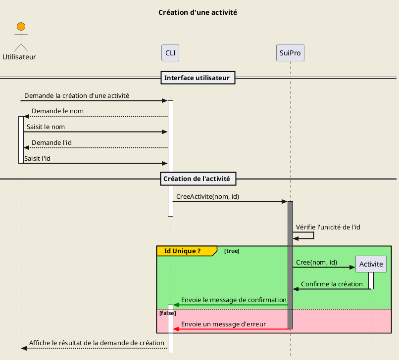

### **Créer une activité**

> Priorité : 1

#### Préconditions:

- Nom fourni
- Id fourni
- Id unique

#### Postconditions:

- Création d'une activité
- Message de confirmation

#### Scénario:

- Saisie du nom
- Saisie de l'id
- Vérification de l'unicité de l'id
- Création de l'activité
- Message de confirmation

#### Table de decision:

| Préconditions             | 1   | 2   | 3   | 4   |
| ------------------------- | --- | --- | --- | --- |
| _Nom fourni_              | Non | Oui | Oui | Oui |
| _Id fourni_               |     | Non | Oui | Oui |
| _Id unique_               |     |     | Non | Oui |
| **Postconditions**        |     |     |     |     |
| _Création d'une activité_ | Non | Non | Non | Oui |
| _Message d'erreur_        | Oui | Oui | Oui | Non |
| **Nombre de tests**       | 1   | 1   | 1   | 1   |

#### Tests `4`:

> TODO

#### Diagramme de séquence:

