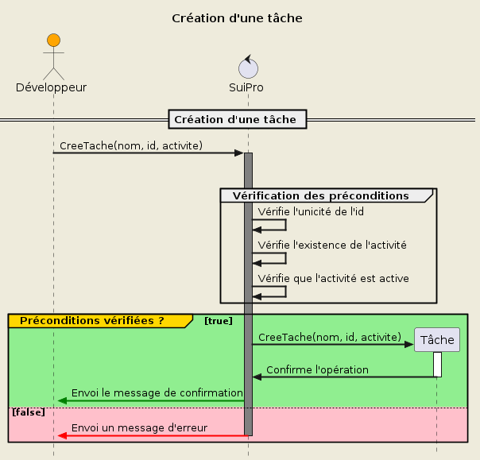

### **Créer une tâche**

> Priorité : 1

#### Préconditions:

- Nom fourni
- Id fourni
- Activité fournie
- Activité existante
- Activité active
- Id unique

#### Postconditions:

- Création d'une tâche
- Message de confirmation

#### Scénario:

- Saisie du nom
- Saisie de l'id
- Saisie de l'activité
- Création de la tâche
- Message de confirmation

#### Table de decision:

| Préconditions          | 1   | 2   | 3   | 4   | 5   | 6   | 7   |
| ---------------------- | --- | --- | --- | --- | --- | --- | --- |
| _Nom fourni_           | Non | Oui | Oui | Oui | Oui | Oui | Oui |
| _Id fourni_            |     | Non | Oui | Oui | Oui | Oui | Oui |
| _Activité fournie_     |     |     | Non | Oui | Oui | Oui | Oui |
| _Activité existante_   |     |     |     | Non | Oui | Oui | Oui |
| _Activité active_      |     |     |     |     | Non | Oui | Oui |
| _Id unique_            |     |     |     |     |     | Non | Oui |
| **Postconditions**     |     |     |     |     |     |     |     |
| _Création d'une tâche_ | Non | Non | Non | Non | Non | Non | Oui |
| _Message d'erreur_     | Oui | Oui | Oui | Oui | Oui | Oui | Non |
| **Nombre de tests**    | 1   | 1   | 1   | 1   | 1   | 1   | 1   |

#### Tests `7`:

> TODO

#### Diagramme de séquence:

<div hidden>

```plantuml
@startuml UC3

!include diag_seq_template.iuml

!$schema = {
    "entity": "Tâche",
    "name": "Création d'une tâche",
    "create": "CreeTache(nom, id, activite)",
    "requirements": [
        "nom",
        "id",
        "activite"
    ],
    "preconditions": [
        {
            "bool": "existante",
            "condition": "ChercherActivitée(activité)",
            "entity": "Activité",
            "opt": "non null"
        },
        {
            "bool": "active",
            "condition": "ActivitéeActive(activité)",
            "entity": "Activité",
            "opt": "= true"
        },
        {
            "bool": "unique",
            "condition": "ChercherTache(id)",
            "entity": "Tâche",
            "opt": "= true"
        }
    ]
}

Draw($schema)

@enduml
```

</div>


