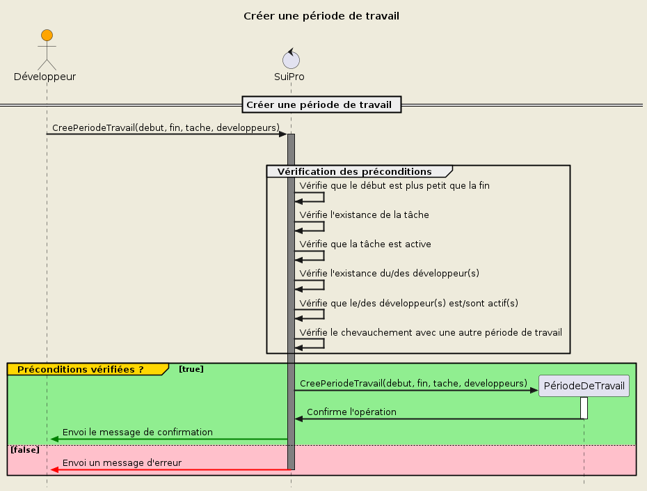

### **Créer une période de travail**

> Priorité : 1

#### Préconditions:

- Début fourni
- Fin fournie
- Début < Fin
- Tâche fournie
- Tâche existante
- Tâche active
- Développeur(s) fourni(s)
- Développeur(s) existant(s)
- Développeur(s) actif(s)
- Pas de chevauchement avec une autre période de travail

#### Postconditions:

- Création d'une période de travail
- Message de confirmation

#### Scénario:

- Saisie du début
- Saisie de la fin
- Saisie de la tâche
- Saisie du/des développeur(s)
- Création de la période de travail
- Message de confirmation

#### Table de decision:

| Préconditions                                            | 1   | 2   | 3   | 4   | 5   | 6   | 7   | 8   | 9   | 10  | 11  |
| -------------------------------------------------------- | --- | --- | --- | --- | --- | --- | --- | --- | --- | --- | --- |
| _Début fourni_                                           | Non | Oui | Oui | Oui | Oui | Oui | Oui | Oui | Oui | Oui | Oui |
| _Fin fournie_                                            |     | Non | Oui | Oui | Oui | Oui | Oui | Oui | Oui | Oui | Oui |
| _Début < Fin_                                            |     |     | Non | Oui | Oui | Oui | Oui | Oui | Oui | Oui | Oui |
| _Tâche fournie_                                          |     |     |     | Non | Oui | Oui | Oui | Oui | Oui | Oui | Oui |
| _Tâche existante_                                        |     |     |     |     | Non | Oui | Oui | Oui | Oui | Oui | Oui |
| _Tâche active_                                           |     |     |     |     |     | Non | Oui | Oui | Oui | Oui | Oui |
| _Développeur fourni_                                     |     |     |     |     |     |     | Non | Oui | Oui | Oui | Oui |
| _Développeur existant_                                   |     |     |     |     |     |     |     | Non | Oui | Oui | Oui |
| _Développeur actif_                                      |     |     |     |     |     |     |     |     | Non | Oui | Oui |
| _Pas de chevauchement avec une autre période de travail_ |     |     |     |     |     |     |     |     |     | Non | Oui |
| **Postconditions**                                       |     |     |     |     |     |     |     |     |     |     |     |
| _Création d'une période de travail_                      | Non | Non | Non | Non | Non | Non | Non | Non | Non | Non | Oui |
| _Message d'erreur_                                       | Oui | Oui | Oui | Oui | Oui | Oui | Oui | Oui | Oui | Oui | Non |
| **Nombre de tests**                                      | 1   | 1   | 1   | 1   | 1   | 1   | 2   | 2   | 2   | 2   | 2   |

#### Tests `16`:

> TODO

#### Diagramme de séquence:

<div hidden>

```plantuml
@startuml UC4

!include diag_seq_template.iuml

!$schema = {
    "entity": "PériodeDeTravail",
    "name": "Créer une période de travail",
    "demande": "Demande la création d'une période de travail",
    "create": "CreePeriodeTravail(debut, fin, tache, developpeurs)",
    "requirements": [
        "début",
        "fin",
        "tâche",
        "développeur(s)"
    ],
    "preconditions": [
        "Vérifie que le début est plus petit que la fin",
        "Vérifie l'existance de la tâche",
        "Vérifie que la tâche est active",
        "Vérifie l'existance du/des développeur(s)",
        "Vérifie que le/des développeur(s) est/sont actif(s)",
        "Vérifie le chevauchement avec une autre période de travail"
    ]
}

Draw($schema)

@enduml
```

</div>


