# Cas d'utilsations :

## Diagramme des cas d'utilisations des développeurs

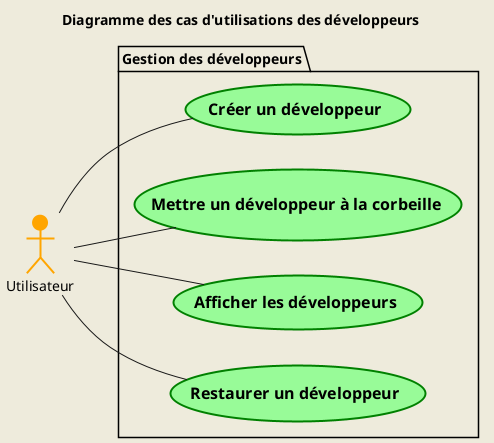

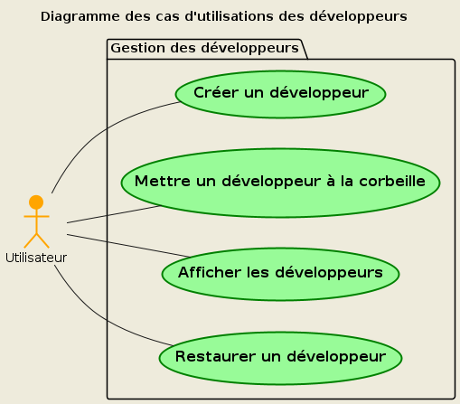

### Détails des cas d'utilisations

- **[Cas d'utilisation 1 : Créer un développeur](<./UCs/UC (1).md>)**
  - Priorité : 1
- **[Cas d'utilisation 5 : Mettre un développeur à la corbeille](<./UCs/UC (5).md>)**
  - Priorité : 2
- **[Cas d'utilisation 8 : Afficher les développeurs](<./UCs/UC (8).md>)**
  - Priorité : 1
- **[Cas d'utilisation 21 : Restaurer un développeur](<./UCs/UC (21).md>)**
  - Priorité : 3

---

## Diagramme des cas d'utilisations des activités

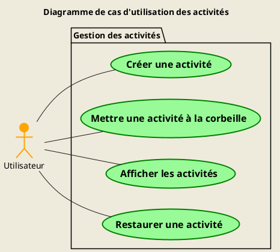

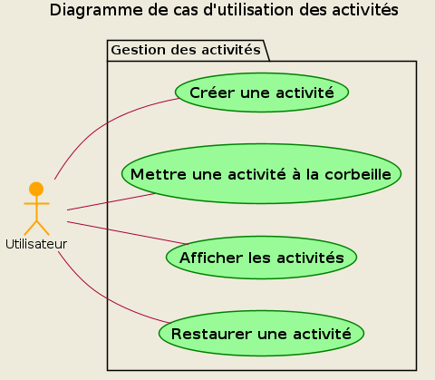

### Détails des cas d'utilisations

- **[Cas d'utilisation 2 : Créer une activité](<./UCs/UC (2).md>)**
  - Priorité : 1
- **[Cas d'utilisation 6 : Mettre une activité à la corbeille](<./UCs/UC (6).md>)**
  - Priorité : 2
- **[Cas d'utilisation 9 : Afficher les activités](<./UCs/UC (9).md>)**
  - Priorité : 1
- **[Cas d'utilisation 22 : Restaurer une activité](<./UCs/UC (22).md>)**
  - Priorité : 3

---

## Diagramme des cas d'utilisations des tâches

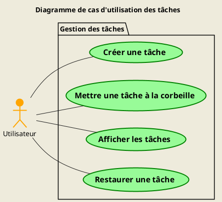

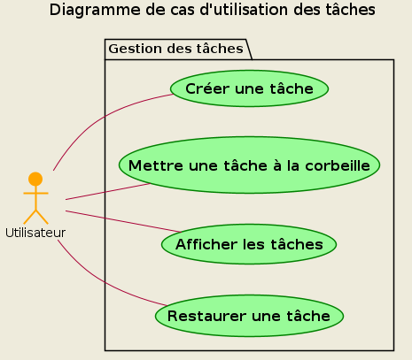

### Détails des cas d'utilisations

- **[Cas d'utilisation 3 : Créer une tâche](<./UCs/UC (3).md>)**
  - Priorité : 1
- **[Cas d'utilisation 7 : Mettre une tâche à la corbeille](<./UCs/UC (7).md>)**
  - Priorité : 2
- **[Cas d'utilisation 10 : Afficher les tâches](<./UCs/UC (10).md>)**
  - Priorité : 1
- **[Cas d'utilisation 23 : Restaurer une tâche](<./UCs/UC (23).md>)**
  - Priorité : 3

---

## Diagramme des cas d'utilisations des périodes de travail

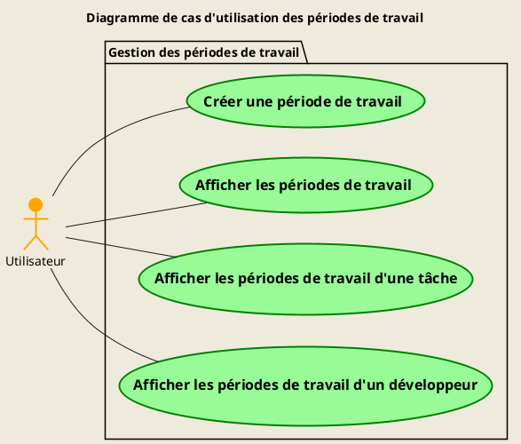

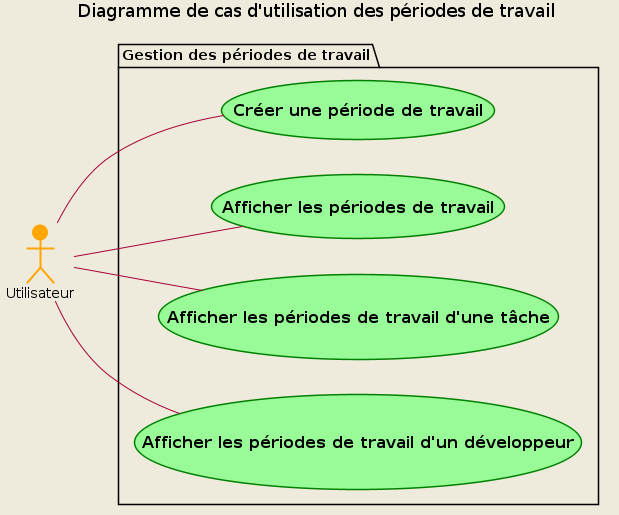

### Détails des cas d'utilisations

- **[Cas d'utilisation 4 : Créer une période de travail](<./UCs/UC (4).md>)**
  - Priorité : 1
- **[Cas d'utilisation 11 : Afficher les périodes de travail](<./UCs/UC (11).md>)**
  - Priorité : 1
- **[Cas d'utilisation 12 : Afficher les périodes de travail d'une tâche](<./UCs/UC (12).md>)**
  - Priorité : 2
- **[Cas d'utilisation 13 : Afficher les périodes de travail d'un développeur](<./UCs/UC (13).md>)**
  - Priorité : 2

---

## Diagramme des cas d'utilisations des labels

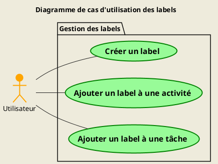

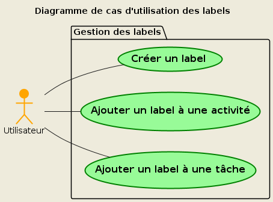

### Détails des cas d'utilisations

- **[Cas d'utilisation 18 : Créer un label](<./UCs/UC (18).md>)**
  - Priorité : 2
- **[Cas d'utilisation 19 : Ajouter un label à une activité](<./UCs/UC (19).md>)**
  - Priorité : 2
- **[Cas d'utilisation 20 : Ajouter un label à une tâche](<./UCs/UC (20).md>)**
  - Priorité : 2

---

## Diagramme des cas d'utilisations de la corbeille

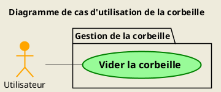

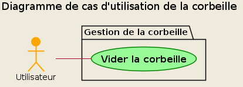

### Détails des cas d'utilisations

- **[Cas d'utilisation 24 : Vider la corbeille](<./UCs/UC (24).md>)**
  - Priorité : 3

---

## Diagramme des cas d'utilisations des calculs

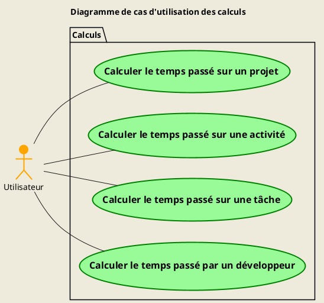

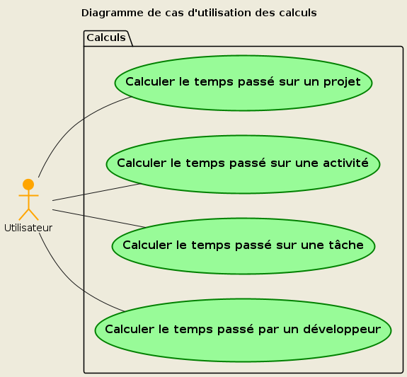

### Détails des cas d'utilisations

- **[Cas d'utilisation 14 : Calculer le temps passé sur un projet](<./UCs/UC (14).md>)**
  - Priorité : 2
- **[Cas d'utilisation 15 : Calculer le temps passé sur une activité](<./UCs/UC (15).md>)**
  - Priorité : 3
- **[Cas d'utilisation 16 : Calculer le temps passé sur une tâche](<./UCs/UC (16).md>)**
  - Priorité : 3
- **[Cas d'utilisation 17 : Calculer le temps passé par un développeur](<./UCs/UC (17).md>)**
  - Priorité : 2

---
